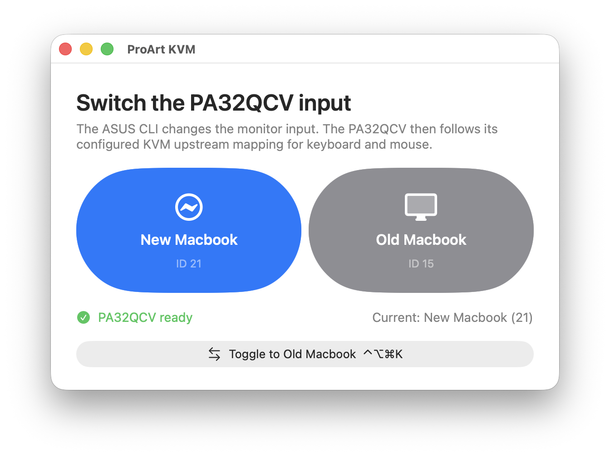

# ProArt KVM

ProArt KVM is a tiny native macOS utility for switching one ASUS ProArt PA32QCV
between a Thunderbolt Mac and a DisplayPort Mac. It uses ASUS's official
Display Control `dwc` command-line binary for discovery and input selection,
including the monitor's KVM behavior. The app downloads and manages that binary
inside Application Support; it does not require Homebrew, BetterDisplay,
`ddcctl`, or a shell PATH entry. Accessibility permission is only needed for
the optional post-switch Lock Screen automation.



This repository is owned by Chase Seibert. Git is used for local versioning and
rollback; it is not assumed to be published or deployed remotely.

## Build and verify

```sh
make setup
make build
make test
```

The build signs the app with the first available local code-signing identity so
macOS permissions remain associated with it across rebuilds. Override it with
`SIGNING_IDENTITY="..." make build` when multiple certificates are installed.

The legacy `make probe` diagnostic remains available for low-level investigation,
but it is not part of normal app setup. The working ASUS CLI uses these
PA32QCV input source IDs:

- Thunderbolt 1: `21`
- DisplayPort 1: `15`
- HDMI 1: `17`

## Install locally

```sh
make install-local
```

Then launch `ProArt KVM.app` from `build/Applications`. A visible onboarding
window opens at launch unless Start with window hidden is enabled. Choose Download, refresh until the PA32QCV appears, and
finish setup. The expandable Settings section can later update the CLI, show
the ASUS monitor ID/serial/device ID, choose which inputs appear, rename each
input, choose its SF Symbol or emoji, and issue an individual test switch.
Command-W closes the window while the menu-bar app keeps running. Install and
configure the same app independently on both Macs.

The default global shortcut is Control-Option-Command-K. The menu-bar menu also
offers direct input selection, Toggle KVM, Settings, and Quit. The app is a
normal Dock application and does not use network services or remote wake.

## Project orientation

Read `AGENTS.md`, then `docs/project-charter.md`, `docs/architecture.md`, and
`docs/setup-install.md`. Implementation lives in `ProArtKVM/`; the hardware
probe lives in `Tools/`; durable project documentation lives in `docs/`.

## Docs and collaboration

- `docs/` contains durable project documentation and decisions.
- `reports/` is reserved for shareable generated reports if needed.
- `tasks/` and `memory/` are not needed for this standalone app today.

To request a new deliverable or change, describe the desired behavior and the
hardware-validation evidence available; update the relevant requirement and
decision docs with the implementation.
